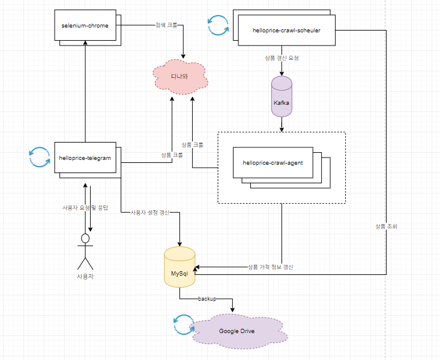

# HelloPrice (헬로프라이스)

- 프로젝트 상세 [헬로프라이스](https://www.podo-dev.com/blogs/185)
- 다나와 최저가 가격 갱신 알림을 주는 텔레그램 봇

 

## Stack

- Java 1.8
- Spring Boot 2.2.0
- Spring Batch
- Spring Cloud Stream
- Spring Data JPA
- QueryDsl
- MySql
- Kafka
- Jsoup
- Selenium 
- Gradle
- [Telegram Java lib](https://github.com/rubenlagus/TelegramBots)

 

## Structure

 

## Module

- **helloprice-core** - 유틸리티 구현
- **helloprice-crawl-scheduler** - 주기적으로 가격 확인이 필요한 상품을 조회, MQ 퍼플리시.
- **helloprice-crawl-agent** - MQ 수신 후, 상품 갱신하는 배치작업을 수행
- **helloprice-crawl-worker** - 다나와 가격 정보를 가져오는 모듈
- **helloprice-domain** - 도메인 (entity, repository)
- **helloprice-telegram** - 텔레그램 봇 구현

 

## Release

#### v2.0
* 2019-11-15
* 상품 검색 기능 추가
* 이메일 알림 기능 추가 
* 커뮤니티 공개

  

###### v2.0.1
* 2019-11-16
* 이메일 알림이 오지 않는 버그 수정(smtp 포트문제)

###### v2.0.2
* 2019-11-19
* 상품 검색 버그 수정(일정시간 후 웹드라이버 세션 종료 버그)

###### v2.0.3
* 2019-11-21
*  재고 입고 알림 버그 수정 (기존에 가격갱신알림으로 전송됨)
* 텔레그램 웹 프리뷰 버그 수정(상품 URL전송시, 웹프리뷰가 보여져 가독성 문제)

###### v2.0.4
* 2019-12-03
* 상품 변화메세지 버그 수정 (기존에 단종, 재고없음 등 판매가아닌 상태에서도, 가격 변화율 메세지를 보여줌)

###### v2.0.5
* 2019-02-23
* MQ를 적용하면서 구조 변경
* 사용자 메세지 전송 시, 이미지 파일엔 알림 음소거 처리
* 사용자 가격 알림 시, 최상단에 요약정보 추가 (텔레그램앱 알림으로 확인 할 수 있도록)

 

#### v1.0

* 2019-11-09
* 헬로프라이스 최초 배포
* 상품 수동 추가 (URL 이용)
* 개인용

 
